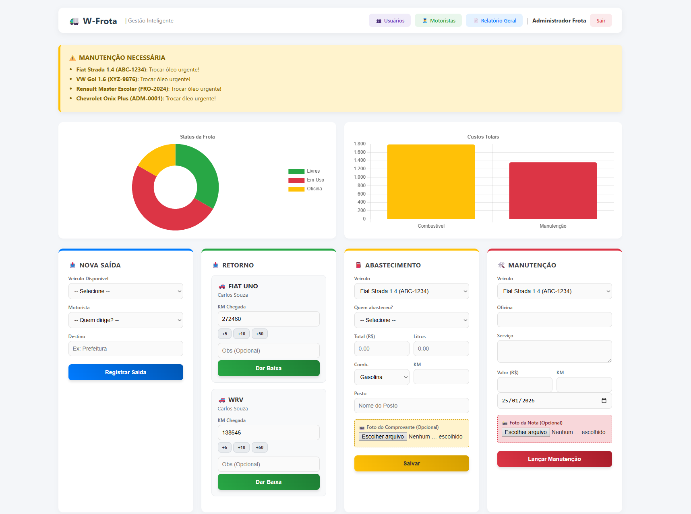
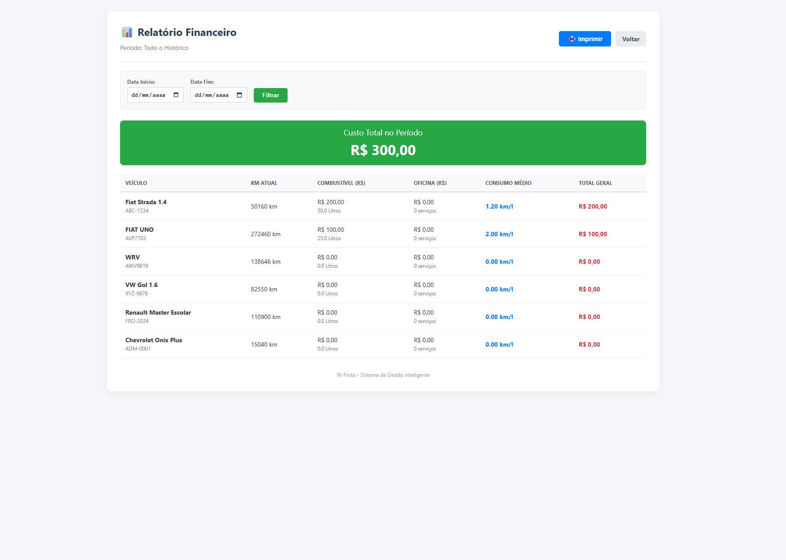
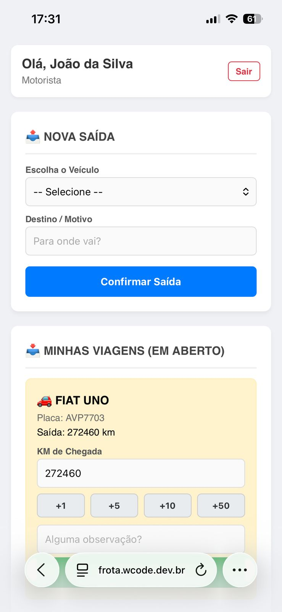

# 🚛 W-Frota | Sistema de Gestão de Veículos

> Sistema completo para controle de frotas, abastecimentos, manutenções e motoristas. Desenvolvido com foco em performance, segurança e usabilidade offline.

## 🚀 Funcionalidades Principais

- **📊 Dashboard Interativo:** Visão geral de custos, status da frota e alertas de manutenção em tempo real.
- **🛡️ Modo Offline (Escudo):** Proteção contra perda de dados quando a internet cai.
- **📅 Relatórios Inteligentes:** Filtros por período, veículo e motorista com cálculo automático de consumo médio (Km/L).
- **⛽ Controle Total:** Gestão de abastecimentos, trocas de óleo e viagens.
- **📱 Responsivo:** Funciona perfeitamente em Desktops e Smartphones.
- **💾 Segurança:** Backup automático e níveis de acesso (Admin/Motorista).

## 📸 Telas do Sistema

| Relatórios Financeiros | Gestão Mobile |
|:---:|:---:|
|  |  |

## 🛠️ Tecnologias Utilizadas

- **Backend:** Node.js, Express
- **Frontend:** EJS, CSS Moderno (Sem frameworks pesados)
- **Banco de Dados:** SQLite (Leve e rápido) / Sequelize ORM
- **Segurança:** Bcrypt (Hash de senhas), Express-Session

## 📦 Como Rodar o Projeto

### Pré-requisitos
- Node.js instalado

### Passo a Passo

1. Clone o repositório:
\`\`\`bash
git clone https://github.com/SEU-USUARIO/w-frota.git
\`\`\`

2. Instale as dependências:
\`\`\`bash
npm install
\`\`\`

3. Configure o Banco de Dados (Popule com dados fictícios para teste):
\`\`\`bash
node popular_banco.js     # Cria a estrutura e usuários
node popular_recheio.js   # Gera histórico de uso
\`\`\`

4. Inicie o Servidor:
\`\`\`bash
npm start
\`\`\`

5. Acesse no navegador:
\`\`\`
http://localhost:3000
\`\`\`

## 👤 Autor

**Wanderley Muzati**
* Desenvolvedor Fullstack em formação
* https://www.linkedin.com/in/neto-buim-0a1698297/